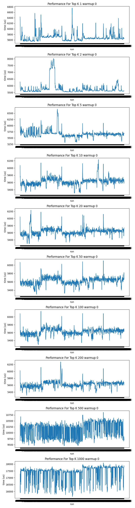

# Benchmark Various ANN Libraries

## Replicating
See [runbook](RUNBOOK.md). 

## Temp Results
```
   top k  recall (%)            var     mean (us)  p95 (us)  p99 (us)
0      1        55.0  174232.215832   7493.751111   8270.80   9230.91
1      2        55.0  171242.354088   7496.981111   8277.70   9279.04
2      5        55.0  316238.827628   7626.012222   8728.85   9362.29
3     10        55.0  157748.885643   7436.418889   8192.55   9063.20
4     20        55.0  160554.080054   7437.628889   8197.20   9065.42
5     50        55.0  379029.840988   7853.288889   8920.05   9554.96
6    100        55.0  165858.769258   7529.054444   8311.15   9225.38
7    200        55.0  169903.969722   7562.016667   8367.15   9269.05
8    500        66.3  113086.289032  13568.531111  14182.80  14819.24
9   1000        78.4  996520.486795  25651.817778  27980.20  28752.07
```


## TODO
1. check if we're still seeing spikes when k = 1
2. Through put (x) vs. latency (y)
3. historgram (y = cnt) (x = latency)
 
look at weaviate & qdrant (distributed vector databases like vortex)
